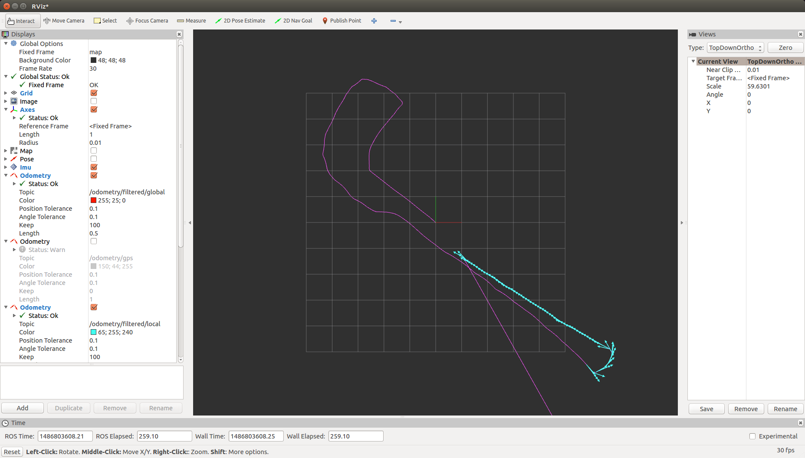

RedBot Odom

Demonstration of localization:

The test was performed in the second floor of the Academic center, in the hallway between the entrance to the Large Project Building and the Robotics Lab.

Using the [SparkFun RedBot](https://www.sparkfun.com/products/12649) as the development platform and ros [differential\_drive](https://github.com/sterlingm/differential-drive) ported for ROS indigo, as well as [ros\_android\_sensors](https://github.com/yycho0108/ros_android_sensors) from my previous development, and finally [robot\_localization](http://docs.ros.org/kinetic/api/robot_localization/html/index.html), this project tackles robot localization through encoder-based odometry sensor fusion with IMU and GPS.
